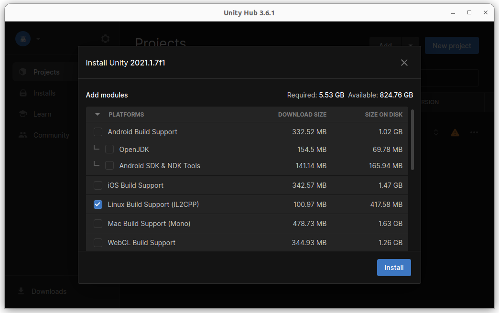
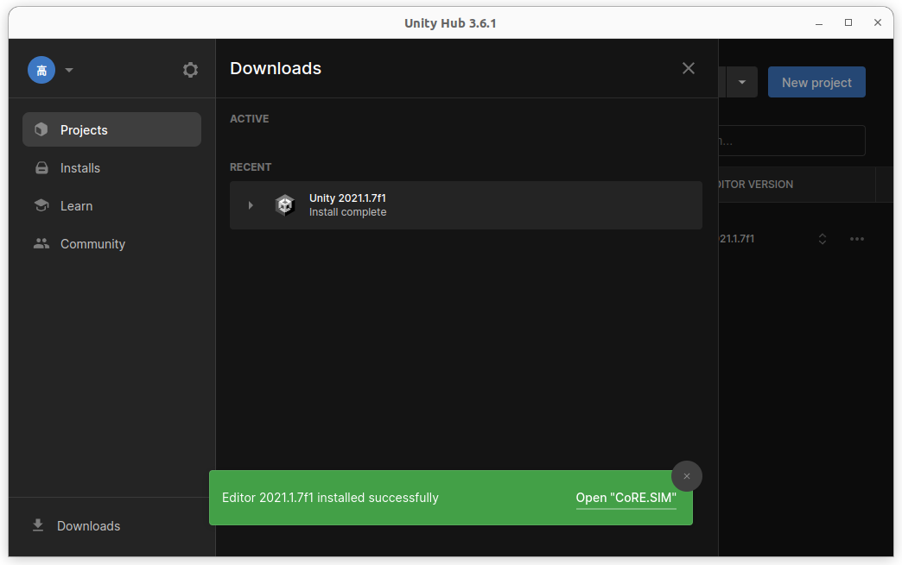
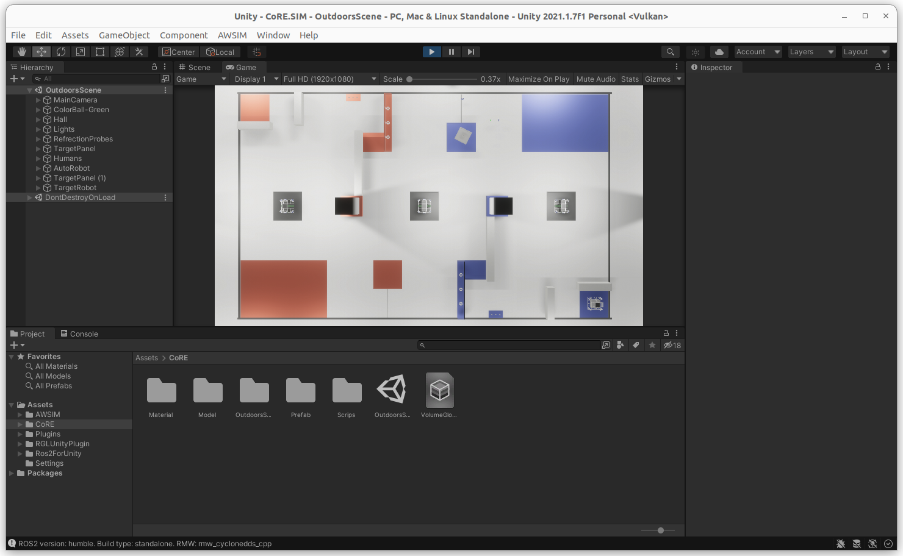

# Unityプロジェクトのセットアップ(推奨)

このページは、CoRE.SIM Unityプロジェクトのセットアップに関するチュートリアルです。

## 環境の準備

### システムのセットアップ

**Ubuntu 22.04 & Ubuntu 20.04**

1. ご使用のマシンが[必要なハードウェア仕様](../QuickStartDemo/#pc-specs)を満たしていることを確認してください。
    - *注意: PCの要件は、シミュレーション内容に応じて変化する可能性があります*
2. Ubuntu 22.04がインストールされたデスクトップPCを用意します。
3. [NVIDIAドライバーとVulkan Graphics API](../QuickStartDemo/#running-the-awsim-simulation-demo)をインストールします。
4. [git](https://git-scm.com/)をインストールします。
5. [ROS 2をインストールします。](https://docs.ros.org/en/humble/Installation/Ubuntu-Install-Debians.html)
6. '.bashrc'と'.profile'に以下を書き込みます。
    ```
    source /opt/ros/humble/setup.bash
    export RMW_IMPLEMENTATION=rmw_cyclonedds_cpp
    ```


### Unity Hubのインストール
[このページ](https://docs.unity3d.com/hub/manual/InstallHub.html#install-hub-linux)の指示に従ってください。

1. 公開署名キーを追加するには、ターミナルで次のコマンドを実行します：
    ```bash
    wget -qO - https://hub.unity3d.com/linux/keys/public | gpg --dearmor | sudo tee /usr/share/keyrings/Unity_Technologies_ApS.gpg > /dev/null
    ```

2. Unity Hubリポジトリを含めるには、`/etc/apt/sources.list.d`にエントリーを作成する必要があります。以下のコマンドを使用してUnity Hubリポジトリを追加します：
    ```bash
    sudo sh -c 'echo "deb [signed-by=/usr/share/keyrings/Unity_Technologies_ApS.gpg] https://hub.unity3d.com/linux/repos/deb stable main" > /etc/apt/sources.list.d/unityhub.list'
    ```

3. パッケージキャッシュを更新し、次のコマンドでUnity Hubをインストールします：
    ```bash
    sudo apt update
    sudo apt install unityhub
    ```

4. Unity Hubを起動し、ライセンスを取得します。ほとんどのユーザーにとって、個人用ライセンスが十分でしょう。

### CoRE.SIMプロジェクトを開く

UnityエディターでUnity CoRE.SIMプロジェクトを開くには：

1. CoRE.SIMリポジトリをクローンしていることを確認してください
    ```
    git clone https://github.com/StrayedCats/CoRE.SIM.git
    ```

2. Unity Hubを起動します。

3. Unity Hubでプロジェクトを開きます
    - `Add` ボタンをクリック

    

    - CoRE.SIMリポジトリがクローンされたディレクトリに移動

    - Unityエディターをインストール

    

    

    - プロジェクトはこれで使用準備ができています

    

!!! warning

    UnityEditorを起動する際にセーフモードのダイアログが表示される場合、opensslをインストールする必要があるかもしれません。

    1. libsslをダウンロード  
    `wget http://archive.ubuntu.com/ubuntu/pool/main/o/openssl/libssl1.1_1.1.0g-2ubuntu4_amd64.deb`
    2. インストール  
    `sudo dpkg -i libssl1.1_1.1.0g-2ubuntu4_amd64.deb`

### CoRE.SIMを実行する

1. `Assets/CoRE/` ディレクトリの下に配置された `OutdoorScene.unity` シーンを開きます。
2. エディターの上部にある `Play` ボタンをクリックしてシミュレーションを実行します。

<br><br><br><br>